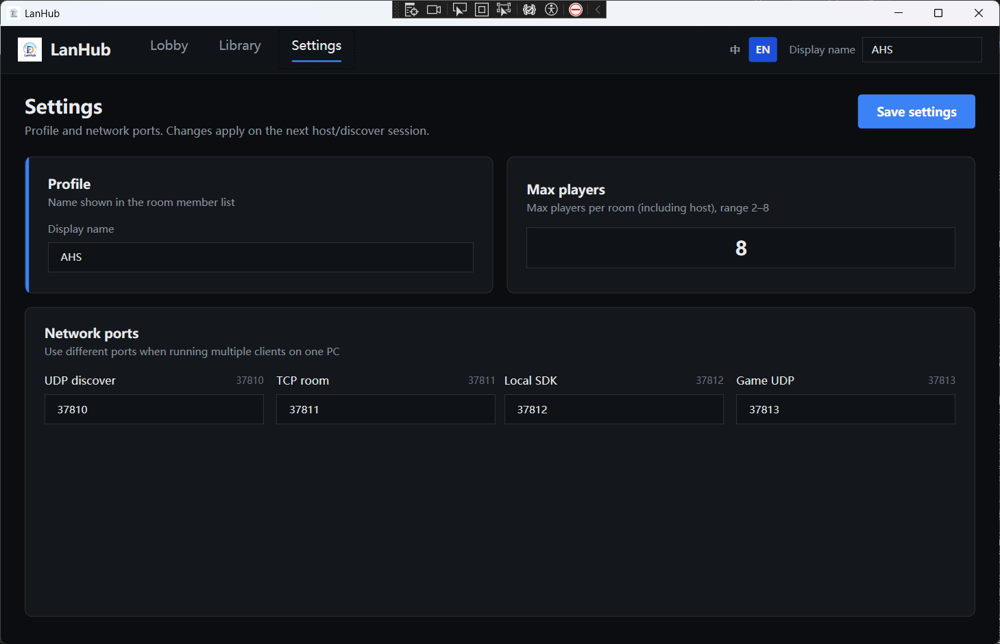
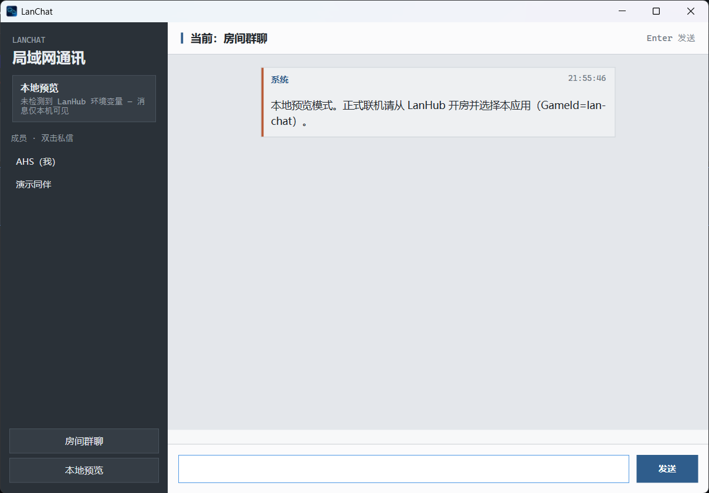
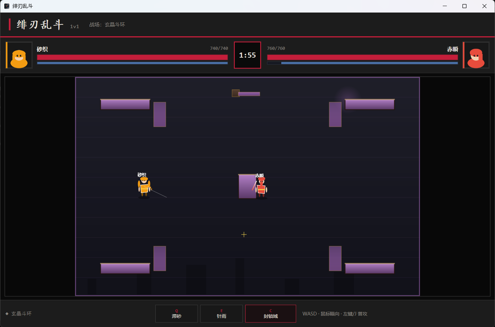

# LanHub

**English** | [中文](README.zh-CN.md)

**Build your own LAN multiplayer games from your ideas.**

LanHub is a same-Wi‑Fi party platform plus **LanHub.Sdk**: you invent the game, integrate the SDK, and friends on the local network join through rooms you host. Only games that use the SDK can multiplayer through the platform — the launcher handles rooms, discovery, room codes, and process launch; in-game networking always goes through the SDK.


---

## Highlights

- Turn a personal game idea into a playable LAN session without writing your own lobby stack
- Host / client rooms with 6-digit codes, encrypted signaling, and encrypted game UDP
- Reliable + unreliable channels (TCP relay / UDP P2P with host fallback)
- C# SDK for .NET games; register any exe in the library with a shared `GameId`
- Sample apps under `game/` so you can copy a working integration pattern

### Screenshots

| Library | Settings |
|:-------:|:--------:|
|  |  |

---

## Download & try

Prebuilt Windows binaries are on **[GitHub Releases](https://github.com/chuqing-web/LanHub-Platform/releases/latest)** (v1.0.0).

| Asset | What you get | GameId |
|-------|--------------|--------|
| [LanHub.zip](https://github.com/chuqing-web/LanHub-Platform/releases/download/v1.0.0/LanHub.zip) | Launcher | — |
| [Lanchat.zip](https://github.com/chuqing-web/LanHub-Platform/releases/download/v1.0.0/Lanchat.zip) | Sample LAN chat | `lan-chat` |
| [ArenaDuel.zip](https://github.com/chuqing-web/LanHub-Platform/releases/download/v1.0.0/ArenaDuel.zip) | Sample 1v1 duel | `arena-duel` |

1. Extract `LanHub.zip` and run `LanHub.exe` (Windows 10/11 x64).
2. Extract the sample zips; in **Library → Add**, register each `.exe` with the GameId above (same ID on every PC).
3. Host creates a room; guests join with the 6-digit code.
4. Both open the **same GameId** from the library — do not double-click the exe in Explorer.

---

## Build from source

Use **Visual Studio 2022** and open `LanHub.sln` (.NET 8).

```bat
dotnet build LanHub.sln -c Release
dotnet run --project src\LanHub\LanHub.csproj
```

| Artifact | Path |
|----------|------|
| Launcher | `src\LanHub\bin\Release\net8.0-windows\LanHub.exe` |
| SDK DLL for games | `src\LanHub.Sdk\bin\Release\net8.0\LanHub.Sdk.dll` (needs `LanHub.Core.dll` beside it) |
| SDK console probe | `src\LanHub.Sdk.Probe\bin\Release\net8.0\LanHub.Sdk.Probe.exe` |

---

## Project layout

| Project | Role |
|---------|------|
| `LanHub` | WPF launcher (host/client, library, settings) |
| `LanHub.Core` | Discovery, rooms, crypto, local SDK endpoint, UDP P2P |
| `LanHub.Sdk` | **DLL every game must reference** |
| `LanHub.Sdk.Probe` | Dev self-test (not a game) |
| `game/LanChat` | Sample: LAN chat over the SDK |
| `game/ArenaDuel` | Sample: 1v1 top-down duel over the SDK |

Default ports: discovery UDP `37810`, room TCP `37811`, local SDK `37812`, game UDP `37813`.

---

## Sample apps (`game/`)

These are **test / reference programs**, not the product itself. Use them to verify the platform end-to-end and as templates when wiring your own game. Prebuilt packages are in [Releases](https://github.com/chuqing-web/LanHub-Platform/releases/latest); source lives under `game/`.

### LanChat (`game/LanChat`)

LAN group chat (plus DMs) built on LanHub.Sdk. Covers connect-from-environment, roster sync, reliable text messages, typing hints, and reconnect UX.



| | |
|--|--|
| **GameId** | `lan-chat` |
| **Best for** | Learning the smallest reliable-message integration |

### ArenaDuel (`game/ArenaDuel`)

1v1 top-down arena fighter: blind character pick, host-authoritative combat, skill inputs, and snapshot sync over reliable + unreliable channels.



| | |
|--|--|
| **GameId** | `arena-duel` |
| **Best for** | Learning host authority, inputs, and high-frequency state |

Register the built exe in the LanHub library with the matching GameId on every machine, join a room, then launch from the library (not by double-clicking the exe in Explorer).

---

## Transport model

| Channel | Path | Typical data |
|---------|------|----------------|
| **reliable** | Game → local LanHub (TCP) → room TCP (AES-GCM) → peer | Commands, chat, match events |
| **unreliable** | Game → local LanHub → **UDP P2P** (host relay fallback) | Position, aim, high-rate snapshots |

Unreliable packets should stay ≤ **1200** bytes; reliable default max is **256 KiB** (`Session.MaxPayloadBytes`).

---

## Integrate your game (SDK guide)

### Who does what

| Actor | Responsibility |
|-------|----------------|
| **LanHub launcher** | Create/join rooms, discover hosts, validate room code, bind GameId, inject env vars, launch library exes |
| **Your game + SDK** | Connect to the local runtime, sync roster, send/receive multiplayer data, implement gameplay |
| **Avoid** | Re-implementing LAN lobbies inside the game, or bypassing the SDK to talk peer-to-peer outside the platform |

```text
Host opens room → guests join with the same room code
  → Everyone launches the same GameId from the library
  → Host process binds the session GameId; guests get a token
  → Game connects via LanHub.Sdk to 127.0.0.1
  → All multiplayer traffic goes through platform relay / UDP P2P
```

### 1. Register the game in the launcher

1. Open **LanHub** → **Library** → **Add**, pick your `.exe`.
2. **Edit** and set:

| Field | Meaning | Rule |
|-------|---------|------|
| **Title** | Display name | Any |
| **GameId** | Stable game ID | **Identical on every PC** (e.g. `mygame-demo`) |
| **Exe path** | Local executable | May differ per machine |
| **Args** | Extra CLI | Optional; online play uses env vars, not args |

> Early debugging: use `LanHub.Sdk.Probe` with GameId `probe` before you have a real game.

### 2. Reference the SDK

**A — ProjectReference (same solution):**

```xml
<ItemGroup>
  <ProjectReference Include="..\..\src\LanHub.Sdk\LanHub.Sdk.csproj" />
</ItemGroup>
```

(Adjust the relative path as needed. Target **.NET 8**.)

**B — DLL reference:** after Release build, copy `LanHub.Sdk.dll` and `LanHub.Core.dll` next to your game (or under `libs/`), then:

```xml
<ItemGroup>
  <Reference Include="LanHub.Sdk">
    <HintPath>libs\LanHub.Sdk.dll</HintPath>
  </Reference>
</ItemGroup>
```

Keep `LanHub.Core.dll` beside `LanHub.Sdk.dll` at runtime.

**Unity:** place the built DLLs under `Assets/Plugins` if your scripting backend can load .NET 8 assemblies. Handle connect/send off the main thread; marshal `MessageReceived` back to the main thread before touching scene objects.

### 3. Connect at startup

Launch **from the LanHub library after joining a room**. Explorer launches miss env vars and cannot join platform multiplayer.

| Variable | Meaning |
|----------|---------|
| `LANHUB_TOKEN` | One-shot session token |
| `LANHUB_GAME_ID` | Must match library GameId |
| `LANHUB_PLAYER_ID` | Unique player id in the room |
| `LANHUB_SDK_PORT` | Local SDK port (default 37812) |

```csharp
using LanHub.Sdk;

public sealed class OnlineSession : IAsyncDisposable
{
    private LanHubClient? _hub;

    public async Task StartAsync()
    {
        _hub = await LanHubClient.ConnectFromEnvironmentAsync();

        _hub.StateChanged += OnStateChanged;
        _hub.RosterUpdated += OnRosterUpdated;
        _hub.PlayerJoined += p => Debug.Log($"joined: {p.DisplayName}");
        _hub.PlayerLeft += p => Debug.Log($"left: {p.DisplayName}");
        _hub.SessionUpdated += OnSessionUpdated;
        _hub.MessageReceived += OnMessage;
        _hub.Error += (code, msg) => Debug.LogWarning($"SDK {code}: {msg}");
        _hub.Disconnected += (code, msg) => Debug.LogWarning($"disconnect {code}: {msg}");

        BootstrapGameplay(_hub);
    }

    public async ValueTask DisposeAsync()
    {
        if (_hub != null)
            await _hub.DisposeAsync();
    }
}
```

Manual connect (debug only):

```csharp
var hub = new LanHubClient();
await hub.ConnectAsync(sdkPort: 37812, token, gameId, playerId);
```

### 4. Session & host authority

```csharp
var me = hub.PlayerId;
var session = hub.Session;

session.SessionId;
session.HostPlayerId;
session.IsHost;       // same as hub.IsHost
session.Transport;
session.Peers;
session.MaxPayloadBytes;
```

Recommended pattern:

1. **Host authority** — the `IsHost` peer simulates the world and broadcasts snapshots.
2. **Clients** — send input only; render host state.
3. Keep entities in sync via `RosterUpdated` / `PlayerJoined` / `PlayerLeft`.
4. On `Reconnecting`, pause; on `Failed` / `SessionEnded`, return to menu.

### 5. Send & receive

SDK carries raw `byte[]`. Pick your own serialization (JSON, MessagePack, custom binary).

Minimal framing: `[type:u8][body...]`.

```csharp
await hub.SendToAllAsync(bytes);                    // reliable broadcast
await hub.SendTextAsync("hello");                   // UTF-8 reliable (debug)
await hub.SendToAsync(targetPlayerId, bytes);       // reliable unicast
await hub.SendUnreliableToAllAsync(posBytes);       // UDP P2P

_hub.MessageReceived += msg =>
{
    // msg.FromPlayerId, msg.Channel, msg.Payload, msg.AsUtf8Text(), ...
    HandlePacket(msg.FromPlayerId, msg.Payload);
};
```

### 6. Lifecycle checklist

| State / event | Game should |
|---------------|-------------|
| `Connected` | Enter online match, refresh roster |
| `Reconnecting` | Show reconnect UI, pause critical ops |
| `Disconnected` / `Failed` | Tear down match objects |
| `PayloadTooLarge` | Shrink or split packets |
| `InvalidToken` | Not launched from LanHub, or session expired |

Always `await hub.DisposeAsync()` on exit.

**Fully integrated when:**

- [ ] References `LanHub.Sdk` (+ loads `LanHub.Core`)
- [ ] Connects only via `ConnectFromEnvironmentAsync()` (or equivalent env)
- [ ] Registered in the library with a shared GameId
- [ ] Subscribes to messages, roster, state, disconnect
- [ ] Uses host authority (or an explicit lockstep design)
- [ ] Critical data → reliable; high-rate visuals → unreliable
- [ ] Handles reconnect / session end
- [ ] Disposes the client on exit

### 7. Tiny console sample

```csharp
using System.Text;
using LanHub.Sdk;

await using var hub = await LanHubClient.ConnectFromEnvironmentAsync();
Console.WriteLine($"I am {hub.PlayerId} host={hub.IsHost}");

hub.MessageReceived += m =>
    Console.WriteLine($"[{m.Transport}/{m.Channel}] {m.FromPlayerId}: {m.AsUtf8Text()}");

hub.RosterUpdated += list =>
    Console.WriteLine("players " + list.Count);

while (true)
{
    var line = Console.ReadLine();
    if (string.IsNullOrEmpty(line)) break;
    if (line.StartsWith("/u "))
        await hub.SendUnreliableToAllAsync(Encoding.UTF8.GetBytes(line[3..]));
    else
        await hub.SendTextAsync(line);
}
```

### FAQ

**Can I multiplayer by double-clicking the game exe?**  
No. Without `LANHUB_TOKEN`, handshake fails. Join a room, then open from the **library**.

**Both sides started but no messages?**  
Same room? Same GameId? Launched from library? Firewall allowing game UDP `37813`? Two LanHub instances fighting over the same ports?

**Two clients on one PC?**  
Yes — give each LanHub instance different TCP / SDK / GameUDP ports in **Settings**, and register the exe in each library.

**Wrap an existing non-SDK commercial game?**  
Not automatically. Without the SDK it can only be launched as a process; its own LAN stack is unchanged.

---

## Quick self-test

1. On both PCs, add the same sample (`LanChat` / `ArenaDuel`) with the listed GameId  
2. Host: Host mode → **Create room** → note the code  
3. Guest: discover host → enter code → **Join**  
4. Host opens the game from the library; guest opens the **same** GameId  
5. Chat or duel should sync  

With Probe: copy Token / PlayerId from the status bar into `LanHub.Sdk.Probe` (GameId `probe`). Plain input = reliable; `/u text` = unreliable; `/players` = roster.

---

## Security notes

- Room codes are not broadcast in UDP discovery  
- Join: HMAC proof + HKDF session key + AES-GCM  
- Join rate-limited per IP; SDK listens on `127.0.0.1` only with a one-shot token  
- Game UDP payloads sealed with the same session key  

---

## Not in scope (yet)

- Voice, achievements, cloud saves, store downloads  
- Official Unity package / C++ SDK (C# DLL works today)  
- Auto-hijacking multiplayer for third-party games that never integrated the SDK  
